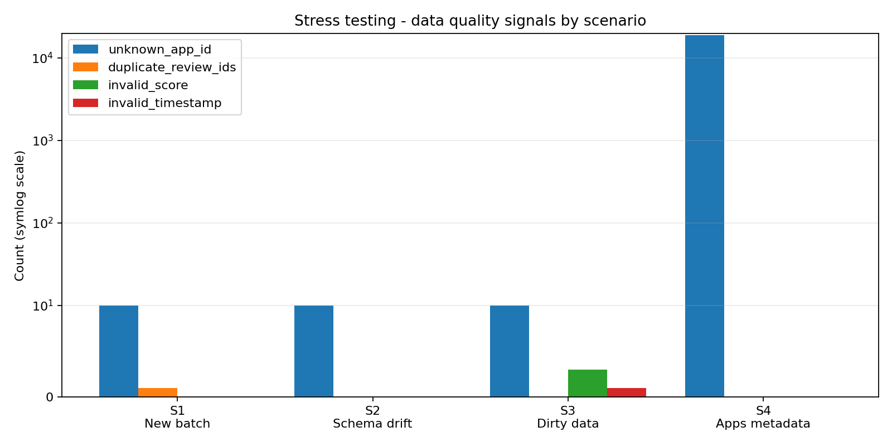
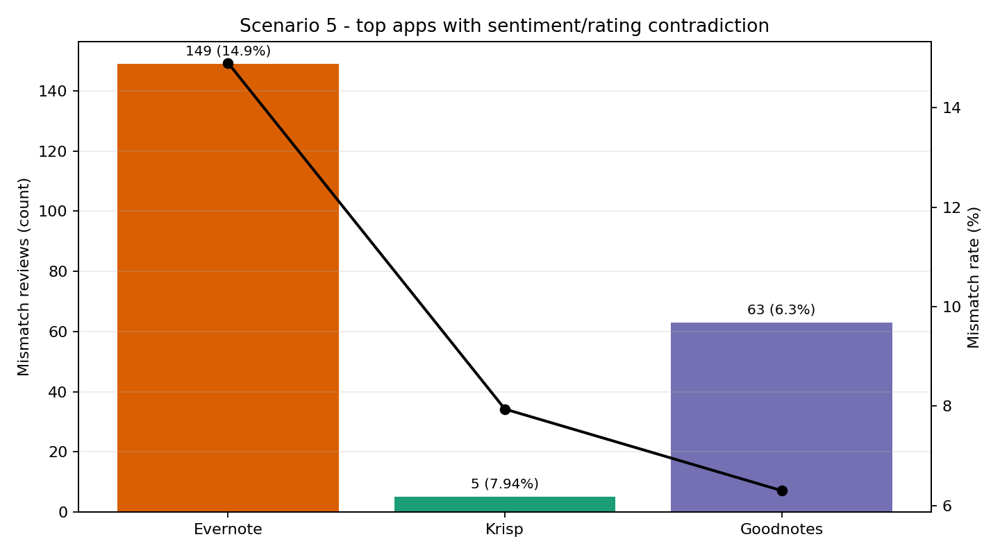
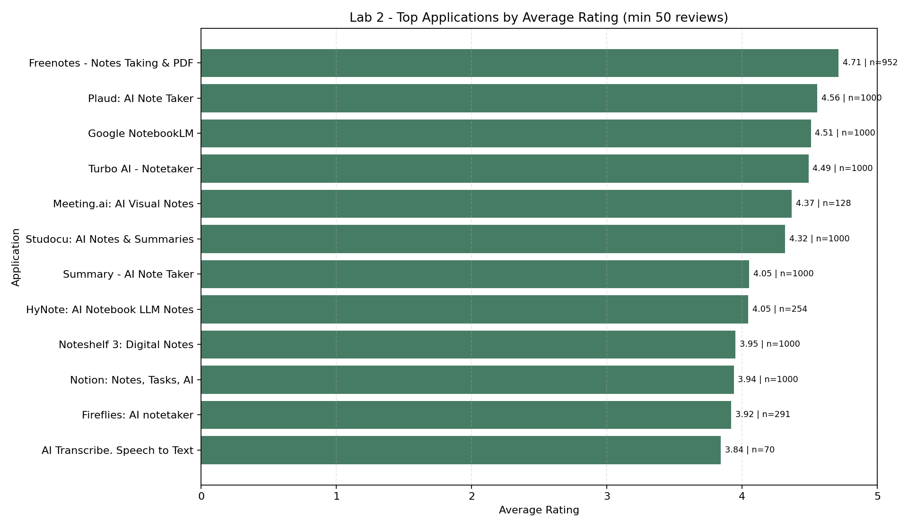
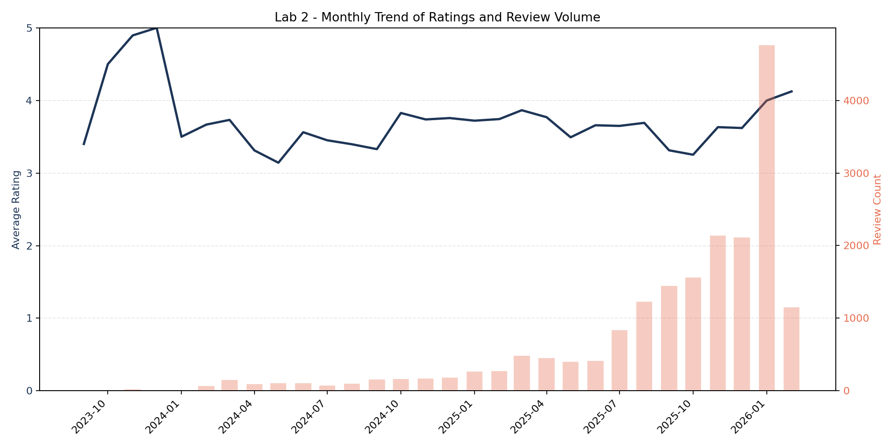

# Labs 1 and 2 - Data Engineering Pipeline

Abderrazzak OUTZOULA & Badrdine Saadioui

Ce depot contient un seul README principal pour les Labs 1 et 2.

## 1) Structure du projet

```text
data/
  raw/                         # fichiers bruts (JSONL + CSV)
  processed/                   # tables transformees, KPI et rapports
resources/
  session1_2_extracted/        # ressources extraites depuis le zip fourni
src/
  ingest.py                    # extraction Google Play (apps + reviews) vers JSONL
  transform.py                 # normalisation des schemas et nettoyage
  serve.py                     # KPI app/jour + KPI sentiment mismatch
  dashboard.py                 # generation du dashboard
  stress_test.py               # execution automatique de la partie C
README.md                      # documentation principale (ce fichier)
Lab1_PythonDataPipeline.pdf
```

## 2) Partie A - Environnement

Nous avons travaille avec Python 3.7+ dans un environnement virtuel dedie.

```powershell
python -m venv .venv
.\.venv\Scripts\activate
python -m pip install --upgrade pip
python -m pip install google-play-scraper pandas matplotlib
```

## 3) Partie B - Pipeline end-to-end

### 3.1 Ingestion

```powershell
python src/ingest.py
```

Sorties produites:
- `data/raw/apps.jsonl`
- `data/raw/reviews.jsonl`

### 3.2 Transformation

```powershell
python src/transform.py
```

Sorties transformees:
- `data/processed/apps.csv`
- `data/processed/reviews.csv`
- `data/processed/quality_report.json`

### 3.3 Serving layer

```powershell
python src/serve.py
```

Sorties de serving:
- `data/processed/app_kpis.csv`
- `data/processed/daily_kpis.csv`
- `data/processed/sentiment_mismatch_kpis.csv`

### 3.4 Dashboard

```powershell
python src/dashboard.py
```

Sortie:
- `data/processed/dashboard.png`

En lecture rapide, le dashboard met en regard le volume de reviews et la note moyenne pour identifier les applications qui performent bien ou mal. Il montre aussi l'evolution quotidienne des notes pour voir si la satisfaction utilisateur s'ameliore ou se degrade dans le temps. Enfin, des indicateurs d'engagement (thumbs up, longueur moyenne des avis, volatilite) permettent de comparer la dynamique des applications.

## 4) Reproductibilite

- Le pipeline fonctionne en full refresh.
- Les fichiers bruts ne sont jamais modifies a la main.
- Les compteurs de qualite sont traces dans `data/processed/quality_report.json`.

## 5) Commandes de reproduction

```powershell
python src/ingest.py
python src/transform.py
python src/serve.py
python src/dashboard.py
python src/stress_test.py
```

## 6) Feedback pris en compte

- Nous avons mis en place une ingestion paginee des reviews pour rendre la collecte plus robuste.
- Nous avons calcule les KPI avec des agregations `pandas groupby` pour simplifier le code et le rendre plus lisible.
- Nous avons ajoute une capture du dashboard dans le rendu.

## 7) Partie C - Stress testing (explication detaillee et appliquee)

### 7.1 L'idee generale

Dans cette partie, nous avons volontairement mis le pipeline dans des situations "inconfortables".
Le but n'etait pas seulement d'obtenir un run qui passe, mais de verifier comment le systeme se comporte quand les hypotheses de depart changent:
- nouvelles donnees avec doublons,
- changement des noms de colonnes,
- donnees sales,
- metadonnees applications incoherentes,
- nouvelle demande metier.

Autrement dit, nous avons cherche a mesurer la robustesse, pas uniquement la fonctionnalite.

### 7.2 Protocole applique

Nous avons applique le protocole suivant pour chaque scenario:
1. remplacer les entrees amont (apps/reviews) par le fichier de scenario;
2. relancer la transformation et le serving en full refresh;
3. capturer les compteurs qualite et les volumes de sortie;
4. analyser l'impact metier dans les KPI;
5. consigner les observations dans `data/processed/stress_test_report.md`.

Execution:

```powershell
python src/stress_test.py
```

### 7.3 Ce que fait le pipeline pendant le stress test

Concretement, pendant chaque run:
- `transform.py` normalise les noms de colonnes (aliases), convertit les types, dedoublonne (`appId`, `reviewId`) et trace les anomalies;
- `quality_report.json` enregistre les signaux: doublons, scores invalides, timestamps invalides, ids inconnus;
- `serve.py` recalcule les KPI applicatifs et journaliers, puis les KPI de contradiction sentiment/note.

Donc meme quand les donnees sont imparfaites, nous gardons deux choses:
- une sortie exploitable pour l'analyse,
- une trace explicite de ce qui n'etait pas propre dans les donnees.

### 7.4 Lecture des resultats (avec figures)

Dans l'ensemble, les 5 scenarios passent (`ok`), mais ils racontent des choses differentes.

**Figure 1 - Signaux de qualite par scenario**



Interpretation:
- scenarios 1 a 3: volumes faibles, anomalies localisees;
- scenario 4: rupture de referentiel entre reviews et apps, ce qui fait monter `unknown_app_id` a `18898`.

**Figure 2 - Top contradictions sentiment vs note (scenario 5)**



Interpretation:
- `Evernote` concentre le plus de contradictions en volume (`149`);
- `Krisp` a un taux plus eleve mais sur moins de reviews;
- la metrique doit toujours etre lue avec le couple volume + pourcentage.

### 7.5 Reponses detaillees aux questions du Lab

#### Scenario 1 - New Reviews Batch

Ce que nous avons observe:
- fichier de 10 reviews avec une duplication de `reviewId` (`r_2002`);
- pipeline relance sans changement de structure majeur.

Ce que le pipeline a fait:
- dedoublonnage par `reviewId` -> 10 entrees deviennent 9 lignes en sortie;
- conservation des reviews meme si l'app n'est pas dans le catalogue courant;
- comptage explicite des ids non resolus (`unknown_app_id = 10`).

Reponse aux questions:
- changements de code: minimes, pas de refonte;
- full refresh: explicite;
- gestion des doublons: suppression deterministe par identifiant;
- reviews orphelines: conservees et tracees.

#### Scenario 2 - Schema Drift in Reviews

Ce que nous avons observe:
- colonnes differentes (`review_id`, `username`, `review_text`, `review_time`, etc.).

Ce que nous avons adapte:
- mapping de colonnes dans la normalisation;
- support du champ `review_time`;
- support du format `%Y/%m/%d %H:%M`.

Resultat:
- pipeline stable;
- `invalid_timestamp = 0` sur ce scenario;
- changement localise a la couche transformation.

Reponse aux questions:
- zone hard-codee principale: normalisation des colonnes reviews;
- sans adaptation: risque de null silencieux sur les dates;
- apres adaptation: comportement explicite et controle.

#### Scenario 3 - Dirty and Inconsistent Data Records

Ce que nous avons observe:
- notes invalides (`five`, `-1`, `0`, vide);
- timestamp invalide (`not_a_date`);
- valeurs manquantes sur certains champs.

Ce que le pipeline a fait:
- conversion des valeurs invalides en `null`;
- conservation des lignes pour ne pas perdre la trace;
- agregations effectuees uniquement sur valeurs valides.

Resultat:
- `invalid_score = 3`;
- `invalid_timestamp = 1`.

Reponse aux questions:
- les erreurs sont detectees et remontees dans les compteurs qualite;
- les donnees sales ne cassent pas le run, mais ne sont pas invisibles non plus.

#### Scenario 4 - Updated Applications Metadata

Ce que nous avons observe:
- metadonnees apps avec doublon d'identifiant et valeurs manquantes;
- referentiel apps tres different du referentiel reviews historique.

Ce que le pipeline a fait:
- dedoublonnage apps: `1` doublon ignore;
- table apps reduite a `9` lignes utiles;
- reviews conservees, mais beaucoup d'apps non resolues (`unknown_app_id = 18898`).

Reponse aux questions:
- unicite `appId` est appliquee;
- la jointure reviews/apps devient fragile si les referentiels ne sont pas alignes;
- l'impact aval est immediatement visible dans les compteurs et KPI.

#### Scenario 5 - New Business Logic Stress Test

Question metier:
- detecter les contradictions entre texte et note (ex: texte negatif + note haute).

Ce que nous avons ajoute:
- un KPI dedie dans le serving: `sentiment_mismatch_kpis.csv`;
- heuristique simple basee sur lexique positif/negatif.

Resultat:
- `30` apps analysees;
- `27` apps avec au moins une contradiction;
- `831` reviews en contradiction.

Reponse aux questions:
- les sorties initiales n'etaient pas suffisantes;
- la logique appartient au serving layer (analytique/metier);
- changement globalement localise, donc maintenable.

### 7.6 Ce que nous retenons

Ce stress testing nous a montre que:
- la qualite des donnees doit etre instrumentee des la transformation;
- la robustesse depend autant des mappings schema que des regles de qualite;
- une nouvelle question metier peut imposer de nouvelles sorties, meme sans changer les raw data.

En pratique, cette partie C nous a servi a transformer un pipeline "qui fonctionne" en pipeline "qui explique ce qu'il fait et ce qu'il ne peut pas garantir".

## 8) Lab 2 - Re-engineering avec dbt + DuckDB

### 8.1 Objectif du Lab 2

Dans le Lab 2, nous avons repris le meme sujet metier (analyse des reviews Play Store), mais avec une architecture plus standard data engineering:
- ingestion conservee en Python (Lab 1),
- transformations et tests dans dbt,
- stockage analytique dans DuckDB.

L'idee etait de separer proprement:
- la couche raw,
- la couche staging,
- la couche marts (schema etoile),
- les tests de qualite.

### 8.2 Structure code du Lab 2

```text
LAB 2/
  docs/
    Lab2_dbtDuckDbETL.pdf
  LAB2_STEP_BY_STEP_PLAN.md
  LAB2_PROGRESS_LOG.md
  lab2_playstore/
    dbt_project.yml
    profiles.yml
    data/
      raw/
        apps.jsonl
        reviews.jsonl
      warehouse/
        lab2_playstore.duckdb
    models/
      staging/
        stg_playstore_apps_raw.sql
        stg_playstore_reviews_raw.sql
        stg_playstore_apps.sql
        stg_playstore_reviews.sql
        schema.yml
      marts/
        dim_apps.sql
        dim_dates.sql
        dim_reviewers.sql
        fct_playstore_reviews.sql
        schema.yml
    tests/
      stg_playstore_apps_store_score_range.sql
      stg_playstore_reviews_thumbs_up_non_negative.sql
```

### 8.3 Methodologie appliquee (pas a pas)

Nous avons suivi une progression stricte en 9 etapes:
1. cadrage des consignes et plan de travail;
2. validation environnement (`duckdb`, `dbt-core`, `dbt-duckdb`);
3. initialisation projet dbt et arborescence cible;
4. configuration `profiles.yml` et `dbt_project.yml` + sanity check;
5. design Kimball (business process, grain, dimensions, facts, bus matrix);
6. implementation du staging (raw readers + standardisation + casts + nettoyage minimal);
7. implementation des tests staging (`not_null`, `unique`, `relationships`, ranges);
8. implementation des marts (dimensions + fact) puis validation;
9. documentation finale centralisee dans ce README.

### 8.4 Ce que nous avons concretement implemente

Staging:
- `stg_playstore_apps_raw` et `stg_playstore_reviews_raw` lisent directement les JSONL via `read_json_auto`;
- `stg_playstore_apps` et `stg_playstore_reviews` standardisent les noms de colonnes, castent les types, nettoient les nulls evidents, et fixent le grain.

Marts:
- `dim_apps`: contexte applicatif complet (app, developer, categorie, score store, installs);
- `dim_dates`: calendrier analytique (`date_sk`, annee, mois, semaine, weekend);
- `dim_reviewers`: auteurs dedoublonnes avec normalisation de casse;
- `fct_playstore_reviews`: grain "1 review = 1 ligne", avec mesures analytiques (`rating_score`, `thumbs_up_count`, `review_count`, `low_rating_flag`).

Qualite / tests:
- staging: `19/19` tests PASS;
- marts: `26/26` tests PASS.

### 8.5 Resultats observes

Tables construites:
- `dim_apps`: `30` lignes;
- `dim_dates`: `736` lignes;
- `dim_reviewers`: `18271` lignes;
- `fct_playstore_reviews`: `18898` lignes.

Controle du grain fact:
- `count(*) = count(distinct review_id) = 18898` (pas de duplication finale).

Periode couverte:
- de `2023-09-04` a `2026-02-05`.

Signal metier global:
- part des reviews avec note faible (`score <= 2`): `27.76%`.

### 8.6 Figures Lab 2

**Figure 3 - Top applications (note moyenne, min 50 reviews)**



Lecture:
- les meilleures notes moyennes se concentrent sur quelques apps avec volume significatif;
- nous lisons toujours la note avec le volume (`n`) pour eviter les faux classements sur petits echantillons.

**Figure 4 - Tendance mensuelle (note moyenne + volume)**



Lecture:
- la qualite percue varie selon les periodes;
- les pics de volume ne correspondent pas toujours a une amelioration de note.

### 8.7 Commandes de reproduction (Lab 2)

Depuis `LAB 2/lab2_playstore`:

```powershell
..\.venv_lab2\Scripts\python.exe -m dbt.cli.main debug --profiles-dir . --project-dir .
..\.venv_lab2\Scripts\python.exe -m dbt.cli.main run --profiles-dir . --project-dir . --select staging
..\.venv_lab2\Scripts\python.exe -m dbt.cli.main test --profiles-dir . --project-dir . --select staging
..\.venv_lab2\Scripts\python.exe -m dbt.cli.main run --profiles-dir . --project-dir . --select marts
..\.venv_lab2\Scripts\python.exe -m dbt.cli.main test --profiles-dir . --project-dir . --select marts
```

Note:
- selon le terminal Windows, la commande `dbt --version` peut ne pas afficher correctement;
- la commande fiable dans notre environnement est `python -m dbt.cli.main ...`.

### 8.8 Tracabilite de ce que nous avons fait

Pour garder un historique propre et reutilisable pour le rapport:
- journal global Lab 1: `LAB_PROGRESS_LOG.md`;
- journal detaille Lab 2: `LAB 2/LAB2_PROGRESS_LOG.md`;
- plan pas a pas Lab 2: `LAB 2/LAB2_STEP_BY_STEP_PLAN.md`.

### 8.9 Conclusion generale (Labs 1 + 2)

Sur le Lab 1, nous avons construit un pipeline Python complet, puis teste sa robustesse avec du stress testing.
Sur le Lab 2, nous avons industrialise le meme cas d'usage avec dbt + DuckDB, schema etoile et tests de qualite formels.
Le resultat final est un flux plus lisible, plus testable, et plus maintenable pour l'analyse.
